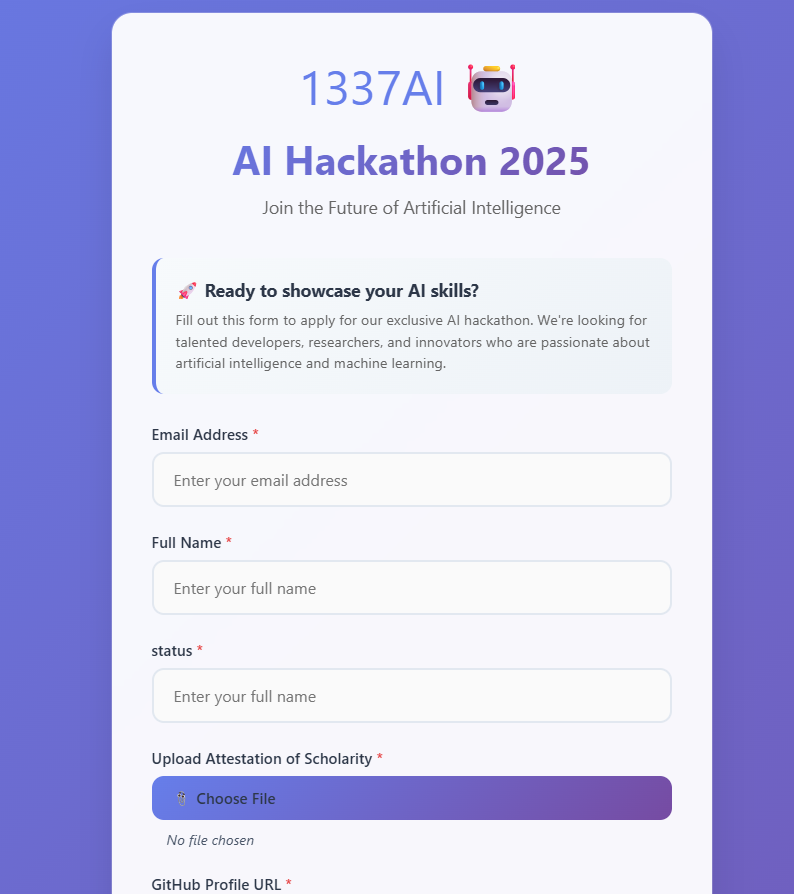
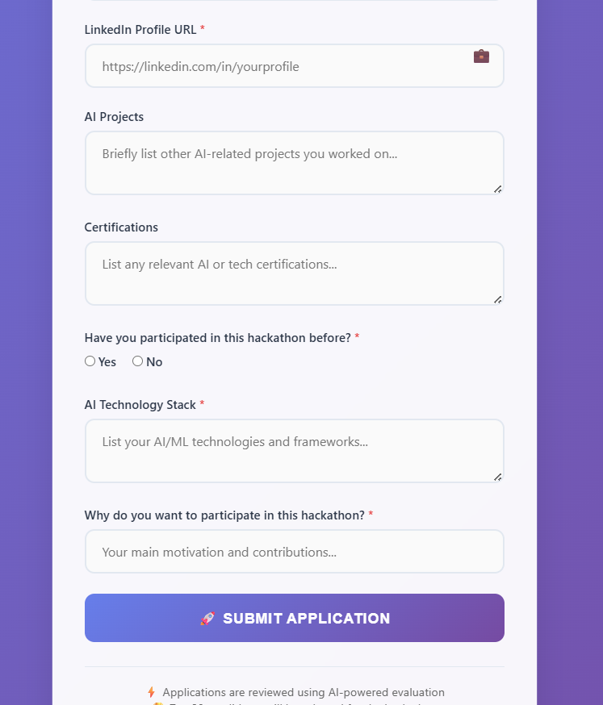
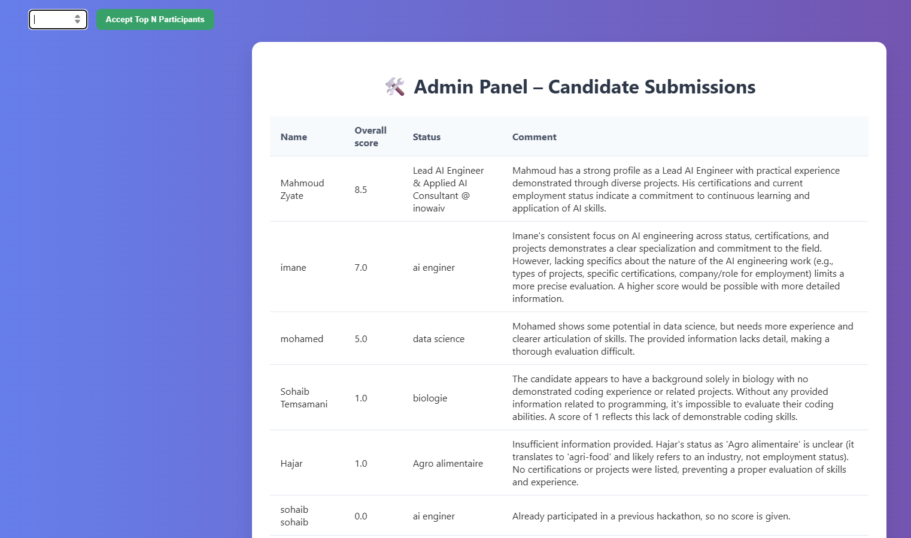
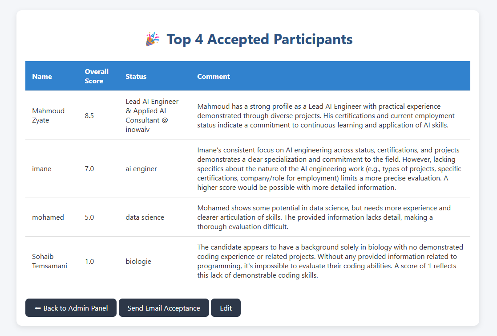

# 🎓 Hackathon-1337AI: Intelligent Pre-Selection AI Agent for Hackathon Candidate Screening

An intelligent web-based system to streamline the process of receiving applications, ranking candidates using AI, and selecting the top submissions.

---

## 🔍 Project Overview

This AI-driven system helps HR departments, universities, and event organizers manage large volumes of candidate submissions quickly and efficiently.

### It includes:
- ✅ A **Submission Form** to collect candidate details  
  
  

- 📊 An **Admin Panel** to view and rank all candidates  
  

- 🏆 A **Selection Interface** to display top applicants based on scores  
  

---

## 🎥 Demo Video

[](app/images/video.mp4)

---

## 📦 Project Structure

```bash
project_root/
├── app/
│   ├── style.css
│   ├── images/
│   │   ├── form_preview.png
│   │   ├── admin_preview.png
│   │   ├── accepted_preview.png
│   │   └── project_tree.png
│   ├── templates/
│   │   ├── form.html
│   │   ├── admin.html
│   │   └── accepted.html
│   ├── submissions.xlsx
│   ├── main.py
│   ├── ai_scoring.py
│   ├── githubsearch.py
│   └── ocr.py
├── docker-compose.yml
├── Dockerfile
└── README.md
